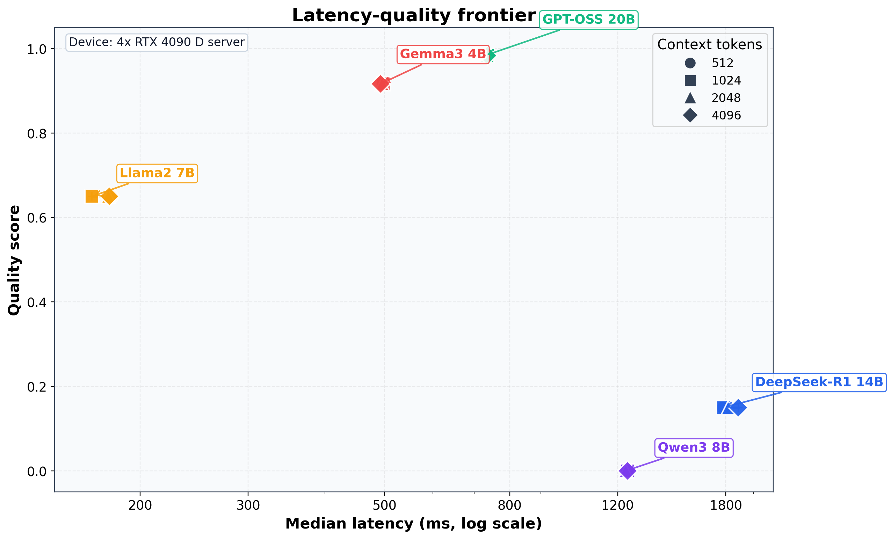
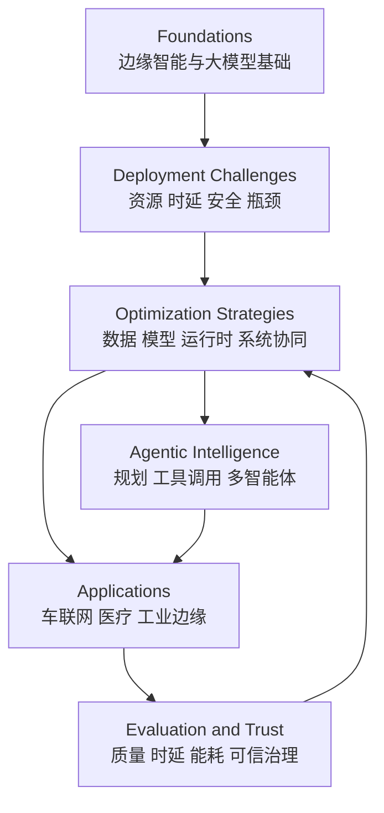

# Cognitive Edge Computing Survey: LLMs and AI Agents for Edge Deployment

A concise, professional survey map for deploying large models and AI agents under real edge constraints.

认知边缘计算综述导航：聚焦大模型与智能体在边缘场景中的可部署优化。

## Table of Contents | 目录

1. [Overview | 概述](#overview--概述)
2. [Scope | 范围](#scope--范围)
3. [Visual Snapshot | 图示概览](#visual-snapshot--图示概览)
4. [Taxonomy | 分类框架](#taxonomy--分类框架)
5. [Key Literature by Category | 分类别核心文献](#key-literature-by-category--分类别核心文献)
6. [Recent Highlights (2024-2025) | 近两年重点文献](#recent-highlights-2024-2025--近两年重点文献)
7. [Evaluation Checklist | 评测清单](#evaluation-checklist--评测清单)
8. [Citation | 引用信息](#citation--引用信息)
9. [License | 许可证](#license--许可证)

## Overview | 概述

### EN

This repository organizes the literature of Cognitive Edge Computing for LLMs and AI Agents into a practical taxonomy.
The focus is deployment realism at the edge: reasoning quality, latency stability, energy efficiency, and security/privacy under resource-constrained environments.

### 中文

本仓库将认知边缘计算相关文献按可部署视角进行结构化整理。
重点不是单一指标提升，而是在边缘资源约束下同时兼顾推理质量、时延稳定、能耗效率与安全隐私。

## Scope | 范围

- Models: LLM, SLM, multimodal language models, MoE variants
- Systems: on-device inference, edge serving, optional cloud collaboration, agent tool-use loops
- Objectives: quality-preserving optimization, efficient serving, trustworthy deployment

## Visual Snapshot | 图示概览

The figure below illustrates a central message of the survey: edge deployment is a multi-objective problem, and no single model dominates quality and latency simultaneously.

下图体现了本文综述的一个核心判断：边缘部署本质上是多目标权衡问题，不存在在质量与时延上同时绝对占优的统一模型。



Figure note:
- EN: A synchronized benchmark on a 4x RTX 4090 D server shows that GPT-OSS 20B is the green upper-right cluster around 730 ms and 0.98 quality, Llama2 7B remains attractive on latency/efficiency, and Gemma3 4B is the red cluster centered near 495 ms and 0.92 quality. This is exactly why edge deployment must be analyzed as a trade-off surface rather than a single ranking.
- 中文：在 4x RTX 4090 D 平台上的同步实验表明，GPT-OSS 20B 对应图中右上方的绿色点簇，约位于 730 ms 和 0.98 质量附近；Llama2 7B 在时延/效率上仍具吸引力；Gemma3 4B 对应约 495 ms 和 0.92 质量附近的红色点簇。这说明边缘部署必须以“权衡前沿”而不是“单一排名”来分析。

## Taxonomy | 分类框架

| Category | Focus (EN) | 中文重点 |
|---|---|---|
| A. Foundations | edge intelligence and LLM fundamentals | 边缘智能与大模型基础 |
| B. Deployment Challenges | compute/memory/latency/security bottlenecks | 算力内存时延与安全瓶颈 |
| C. Optimization Strategies | data/model/runtime/system co-optimization | 数据/模型/运行时/系统协同优化 |
| D. Agentic Intelligence | planning, tool-use, multi-agent collaboration | 规划、工具调用、多智能体协同 |
| E. Applications | mobility, healthcare, industrial edge AI | 车联网、医疗、工业边缘应用 |
| F. Evaluation & Trust | reproducibility, metrics, governance | 可复现评测与可信治理 |



Diagram note:
- EN: This condensed framework follows the paper's logic: challenges drive optimization, optimization enables agentic and domain deployment, and evaluation closes the loop.
- 中文：这个简化框架遵循论文主线：挑战驱动优化，优化支撑智能体与应用落地，评测再反向约束设计。

## Key Literature by Category | 分类别核心文献

The list below emphasizes representative papers that help readers quickly understand what each category contributes to edge deployment research.

下列文献优先选择具有代表性的工作，用于帮助读者快速把握各类别对边缘部署研究分别解决了什么问题。

Direct links are added where a stable publisher page or arXiv record is available.

在存在稳定出版社页面或 arXiv 记录时，下面条目补充了直达链接。

### A. Foundations

- Shi et al., [Edge Computing: Vision and Challenges](https://doi.org/10.1109/jiot.2016.2579198), IEEE IoT Journal, 2016. Defines the classical edge-computing setting and the resource bottlenecks inherited by later LLM systems.
- Zhou et al., [Edge Intelligence: Paving the Last Mile of Artificial Intelligence with Edge Computing](https://doi.org/10.1109/jproc.2019.2918951), Proceedings of the IEEE, 2019. Frames AI-at-the-edge as a joint problem of orchestration, service quality, and distributed resource management.
- Deng et al., [Edge intelligence: The confluence of edge computing and artificial intelligence](https://doi.org/10.1109/jiot.2020.2984887), IEEE IoT Journal, 2020. Provides the broader pre-LLM systems context needed to understand why edge intelligence evolved toward cognitive edge computing.
- Vaswani et al., Attention Is All You Need, NeurIPS, 2017. Supplies the transformer foundation on which most deployable language models are built.
- Brown et al., Language Models are Few-Shot Learners, NeurIPS, 2020. Establishes scale-driven in-context learning as the capability target that edge deployment tries to preserve.
- Wei et al., Emergent Abilities of Large Language Models, TMLR, 2022. Explains why scaling changes model behavior and why compression must protect more than perplexity alone.
- Lu et al., [Small Language Models: Survey, Measurements, and Insights](https://arxiv.org/abs/2409.15790), 2024. Maps the compact-model design space that is most relevant to realistic edge deployment.
- Zheng et al., [A Review on Edge Large Language Models: Design, Execution, and Applications](https://doi.org/10.1145/3719664), ACM CSUR, 2025. Serves as the closest neighboring review focused specifically on edge-side LLM execution.

### B. Deployment Challenges

- Gholami et al., A Survey of Quantization Methods for Efficient Neural Network Inference, 2022. Summarizes the compression toolbox that underlies most practical edge-model reduction pipelines.
- Nagel et al., [A White Paper on Neural Network Quantization](https://arxiv.org/abs/2106.08295), 2021. Clarifies calibration errors, accuracy collapse, and other quantization failure modes faced in deployment.
- Kwon et al., [Efficient Memory Management for Large Language Model Serving with PagedAttention](https://doi.org/10.1145/3600006.3613165), SOSP, 2023. Demonstrates that serving memory and KV-cache behavior are first-order bottlenecks, not secondary implementation details.
- Murthy et al., [MobileAIBench: Benchmarking LLMs/LMMs for On-Device Use Cases](https://arxiv.org/abs/2406.10290), 2024. Provides a device-relevant benchmark basis for assessing realistic mobile and on-device workloads.
- Xiao et al., [Understanding Large Language Models in Your Pockets: Performance Study on COTS Mobile Devices](https://arxiv.org/abs/2410.03613), 2024. Characterizes the actual runtime behavior of pocket-scale inference on commodity mobile platforms.
- Han et al., [LLM Multi-Agent Systems: Challenges and Open Problems](https://arxiv.org/abs/2402.03578), 2024. Highlights how planning, communication, and tool-use loops amplify latency, cost, and safety pressure at the edge.
- Carlini et al., Extracting Training Data from Large Language Models, USENIX Security, 2021. Anchors the privacy-leakage threat model that remains relevant for sensitive edge workloads.
- Dwork and Roth, [The Algorithmic Foundations of Differential Privacy](https://doi.org/10.1561/0400000042), 2014. Provides the formal privacy framework most often used when edge AI must satisfy data minimization requirements.

### C. Optimization Strategies

- Qin et al., [Enabling On-Device Large Language Model Personalization with Self-Supervised Data Selection and Synthesis](https://doi.org/10.1145/3649329.3655665), DAC, 2024. Represents the data-centric path, showing that deployment quality can be improved without relying only on larger models.
- Jacob et al., Quantization and Training for Integer-Arithmetic-Only Inference, CVPR, 2018. Supplies an early efficient-inference baseline that still informs integer-oriented deployment practice.
- Frantar et al., GPTQ, ICLR, 2023. Became a standard post-training quantization reference for preserving LLM quality under aggressive compression.
- Dettmers et al., QLoRA, NeurIPS, 2023. Shows how efficient fine-tuning can be layered on top of quantized models rather than replacing them.
- Tan et al., [MobileQuant: Mobile-friendly Quantization for On-device Language Models](https://doi.org/10.18653/v1/2024.findings-emnlp.570), EMNLP Findings, 2024. Targets mobile-specific constraints and therefore connects compression decisions with actual device behavior.
- Jeon et al., [A Frustratingly Easy Post-Training Quantization Scheme for LLMs](https://doi.org/10.18653/v1/2023.emnlp-main.892), EMNLP, 2023. Provides a strong lightweight PTQ baseline for practical comparisons.
- Lin et al., AWQ, ML Systems, 2024. Uses activation-aware quantization to improve the quality-efficiency balance relevant to deployment.
- Dao, FlashAttention-2, ICLR, 2024. Represents kernel-level acceleration for attention-dominated inference paths.
- Li et al., EAGLE-2, EMNLP, 2024. Illustrates decoding-side acceleration where the latency gains come from generation strategy, not only from compression.
- Zhao et al., [QSpec: Speculative Decoding with Complementary Quantization Schemes](https://arxiv.org/abs/2410.11305), 2024. Highlights the interaction between speculative decoding and quantized execution.
- Tian et al., [An Edge-Cloud Collaboration Framework for Generative AI Service Provision with Synergetic Big Cloud Model and Small Edge Models](https://doi.org/10.1109/mnet.2024.3420755), IEEE Network, 2024. Summarizes how selective cloud assistance can be integrated when pure local execution is insufficient.
- Zhang et al., [EdgeShard: Efficient LLM Inference via Collaborative Edge Computing](https://doi.org/10.1109/jiot.2024.3524255), IEEE IoTJ, 2024. Gives a concrete systems example of collaborative inference across edge resources.

### D. Agentic Intelligence

- Dorri et al., [Multi-agent Systems: A Survey](https://doi.org/10.1109/access.2018.2831228), IEEE Access, 2018. Provides the classical coordination vocabulary behind later LLM-agent interaction patterns.
- Shen et al., HuggingGPT, 2023. Offers an early influential example of tool-augmented orchestration rather than single-model prompting.
- Han et al., LLM Multi-Agent Systems, 2024. Summarizes the major system risks, communication overheads, and coordination costs introduced by multi-agent designs.
- Yan et al., [Beyond Self-Talk: A Communication-Centric Survey of LLM-based Multi-Agent Systems](https://arxiv.org/abs/2502.14321), 2025. Is especially useful for edge settings where communication cost and message topology directly affect feasibility.
- Belcak et al., [Small Language Models are the Future of Agentic AI](https://arxiv.org/abs/2506.02153), 2025. Makes the practical case that SLM-first agents are often better aligned with deployment constraints.
- Gao et al., [A Survey of Self-Evolving Agents: On Path to Artificial Super Intelligence](https://arxiv.org/abs/2507.21046), 2025. Covers adaptive agent pipelines where policies and behaviors continue to improve after initial deployment.
- Rivkin et al., [AIoT Smart Home via Autonomous LLM Agents](https://doi.org/10.1109/jiot.2024.3471904), 2024. Grounds the agent discussion in a concrete edge-resident smart-home case.

### E. Applications

- Abdin et al., [Phi-4 Technical Report](https://arxiv.org/abs/2412.08905), 2024. Represents compact but capable model design that is directly relevant to edge-side comparison.
- Team Gemma, [Gemma: Open Models Based on Gemini Research and Technology](https://arxiv.org/abs/2403.08295), 2024. Serves as a widely adopted open baseline for deployable language inference.
- Mehta et al., OpenELM, 2024. Emphasizes efficiency-aware model design instead of treating compression as an afterthought.
- Marone et al., [mmBERT: A Modern Multilingual Encoder with Annealed Language Learning](https://arxiv.org/abs/2509.06888), 2025. Provides a multilingual encoder reference for retrieval-heavy pipelines that may run near the data source.
- Chiu et al., [V2V-LLM: Vehicle-to-Vehicle Cooperative Autonomous Driving with Multi-Modal Large Language Models](https://arxiv.org/abs/2502.09980), 2025. Illustrates cooperative vehicular reasoning where edge latency and coordination both matter.
- Hu et al., [LLM-based Misbehavior Detection Architecture for Enhanced Traffic Safety in Connected Autonomous Vehicles](https://doi.org/10.1109/tvt.2025.3551327), 2025. Shows how edge intelligence is used for safety-sensitive transport monitoring.
- Ren et al., [Industrial Internet of Things with Large Language Models (LLMs): an Intelligence-based Reinforcement Learning Approach](https://doi.org/10.1109/tmc.2024.3522130), 2024. Extends the discussion into industrial environments with stronger reliability and control constraints.
- Hu et al., [Realizing Efficient On-Device Language-Based Image Retrieval](https://doi.org/10.1145/3649896), 2024. Demonstrates a concrete multimodal retrieval workload that fits constrained devices.

### F. Evaluation and Trust

- Strubell et al., [Energy and Policy Considerations for Modern Deep Learning Research](https://doi.org/10.1609/aaai.v34i09.7123), AAAI, 2020. Reminds the field that efficiency and environmental cost must be reported rather than left implicit.
- Dwork and Roth, The Algorithmic Foundations of Differential Privacy, 2014. Remains the core privacy baseline for sensitive edge workloads.
- Laskaridis et al., [Mobile and Edge Evaluation of Large Language Models](https://doi.org/10.36227/techrxiv.172115025.57884352/v1), 2024. Helps define realistic benchmarking methodology for edge-oriented model comparison.
- Murthy et al., MobileAIBench, 2024. Supports cross-model evaluation on tasks and devices closer to actual deployment practice.
- Oliinyk et al., Fuzzing BusyBox with LLM support, USENIX Security, 2024. Shows that LLM-assisted security tooling is now relevant to embedded software stacks.
- Ma et al., LLM-assisted fuzzing of IoT device stacks, USENIX Security, 2024. Connects model-assisted reasoning with concrete IoT vulnerability discovery workflows.
- Gilbert et al., [Large Language Model AI Chatbots Require Approval as Medical Devices](https://doi.org/10.1038/s41591-023-02412-6), Nature Medicine, 2023. Highlights the governance and regulatory implications of deploying language systems in sensitive domains.

## Recent Highlights (2024-2025) | 近两年重点文献

### Systems and Serving

This line of work pushes edge deployment from proof-of-concept execution toward practical serving stacks that optimize startup cost, generation latency, memory footprint, and accelerator utilization together.

这一方向的研究正把边缘部署从“能跑起来”推进到“可稳定服务”，重点同时优化启动开销、生成时延、显存占用与硬件利用率。

- [PowerInfer-2: Fast Large Language Model Inference on a Smartphone](https://arxiv.org/abs/2406.06282). arXiv, 2024. A strong reference for phone-class large-model execution.
- [EdgeLLM: Fast On-Device LLM Inference with Speculative Decoding](https://doi.org/10.1109/tmc.2024.3513457). IEEE Transactions on Mobile Computing, 2024. Shows how decoding policy directly changes on-device latency.
- [SwapMoE: Serving Off-the-shelf MoE-based Large Language Models with Tunable Memory Budget](https://doi.org/10.18653/v1/2024.acl-long.363). ACL, 2024. Highlights memory-budget-aware serving for sparse expert models.
- [Fast On-Device LLM Inference with NPUs](https://doi.org/10.1145/3669940.3707239). ASPLOS, 2025. Demonstrates the growing importance of mobile accelerator backends.
- [Lincoln: Real-Time 50-100B LLM Inference on Consumer Devices with LPDDR-Interfaced, Compute-Enabled Flash Memory](https://doi.org/10.1109/hpca61900.2025.00128). HPCA, 2025. Pushes very large-model inference closer to consumer-device feasibility.
- [Marlin: Mixed-precision Auto-regressive Parallel Inference on Large Language Models](https://doi.org/10.1145/3710848.3710871). PPoPP, 2025. Optimizes high-throughput serving through mixed-precision generation.

### Collaboration and Routing

Recent collaboration work treats routing as a first-class control problem: deciding when to stay local, when to shard, and when to escalate to a stronger remote model under latency and quality constraints.

近期协同研究把路由本身视为一类核心控制问题，即在时延与质量约束下，决定何时本地执行、何时边缘分片、何时升级到更强的远端模型。

- [EdgeShard: Efficient LLM Inference via Collaborative Edge Computing](https://doi.org/10.1109/jiot.2024.3524255). IEEE Internet of Things Journal, 2024. Frames collaboration as a systems-level response to memory and load limits.
- [Quality-of-Service Aware LLM Routing for Edge Computing with Multiple Experts](https://doi.org/10.1109/tmc.2025.3590969). IEEE Transactions on Mobile Computing, 2025. Treats routing as an explicit service-quality optimization problem.
- [CLONE: Customizing LLMs for Efficient Latency-Aware Inference at the Edge](https://arxiv.org/abs/2506.02847). arXiv, 2025. Connects edge adaptation with latency-aware customization.
- [DiSCo: Device-Server Collaborative LLM-Based Text Streaming Services](https://arxiv.org/abs/2502.11417). arXiv, 2025. Provides a concrete collaborative service architecture for streaming outputs.
- [Federated Black-box Prompt Tuning System for Large Language Models on the Edge](https://doi.org/10.1145/3636534.3698856). MobiCom, 2024. Shows how collaboration can happen without centralizing raw private data.

### Hardware-Aware Acceleration

Hardware-aware studies make it clear that edge LLM progress is not only algorithmic; deployment quality increasingly depends on how models are mapped onto NPUs, PIM, FPGA, and low-bit CPU backends.

硬件感知方向说明，边缘大模型进展并不只是算法改进，部署效果越来越取决于模型如何映射到 NPU、PIM、FPGA 与低比特 CPU 后端。

- [Cambricon-LLM: A Chiplet-based Hybrid Architecture for On-Device Inference of 70B LLM](https://doi.org/10.1109/micro61859.2024.00108). MICRO, 2024. Explores hardware architecture support for very large on-device models.
- [PAISE: PIM-Accelerated Inference Scheduling Engine for Transformer-based LLM](https://doi.org/10.1109/hpca61900.2025.00126). HPCA, 2025. Pushes scheduling intelligence into the memory-centric acceleration path.
- [FACIL: Flexible DRAM Address Mapping for SoC-PIM Cooperative On-device LLM Inference](https://doi.org/10.1109/hpca61900.2025.00127). HPCA, 2025. Focuses on memory mapping and SoC-PIM cooperation.
- [T-MAC: CPU Renaissance via Table Lookup for Low-bit LLM Deployment on Edge](https://doi.org/10.1145/3689031.3696099). EuroSys, 2025. Reopens the low-bit CPU deployment path for edge inference.
- [Understanding the Potential of FPGA-based Spatial Acceleration for Large Language Model Inference](https://doi.org/10.1145/3656177). ACM TRETS, 2024, and [Pushing up to the Limit of Memory Bandwidth and Capacity Utilization for Efficient LLM Decoding on Embedded FPGA](https://doi.org/10.23919/date64628.2025.10993087). DATE, 2025. Together they frame FPGA deployment as a specialized but increasingly relevant embedded path.

### Multimodal and Domain Deployment

The most visible application trend is that edge intelligence is moving beyond text-only assistants into multimodal perception, smart-home coordination, industrial control, and cooperative mobility.

最明显的应用趋势是，边缘智能正在从纯文本助手扩展到多模态感知、智能家居协同、工业控制与协同交通等场景。

- [Self-adapting Large Visual-Language Models to Edge Devices Across Visual Modalities](https://doi.org/10.1007/978-3-031-73390-1_18). ECCV, 2024. Demonstrates modality-aware VLM adaptation for edge conditions.
- [MiniCPM-V: A GPT-4V Level MLLM on Your Phone](https://arxiv.org/abs/2408.01800). arXiv, 2024. A notable on-phone multimodal deployment reference.
- [MobileLLM-R1: Exploring the Limits of Sub-Billion Language Model Reasoners with Open Training Recipes](https://arxiv.org/abs/2509.24945). arXiv, 2025. Pushes compact reasoning models into the practical edge range.
- [VaVLM: Toward Efficient Edge-Cloud Video Analytics With Vision-Language Models](https://doi.org/10.1109/tbc.2025.3549983). IEEE Transactions on Broadcasting, 2025. Extends the survey toward video analytics with edge-cloud cooperation.
- [Industrial Internet of Things with Large Language Models (LLMs): an Intelligence-based Reinforcement Learning Approach](https://doi.org/10.1109/tmc.2024.3522130). IEEE Transactions on Mobile Computing, 2024. Grounds the industrial edge case with stronger reliability constraints.
- [AIoT Smart Home via Autonomous LLM Agents](https://doi.org/10.1109/jiot.2024.3471904). IEEE Internet of Things Journal, 2024. Shows autonomous agents embedded in smart-home control loops.
- [V2V-LLM: Vehicle-to-Vehicle Cooperative Autonomous Driving with Multi-Modal Large Language Models](https://arxiv.org/abs/2502.09980). arXiv, 2025. Represents cooperative mobility and vehicular reasoning at the edge.

## Evaluation Checklist | 评测清单

Recommended minimum report for each study:

- Quality: accuracy/task success/reasoning fidelity
- Performance: throughput, TTFT, p95/p99 latency
- Efficiency: memory footprint, energy per token
- Deployment: on-device ratio, optional offload ratio (when cloud collaboration is enabled)
- Reliability: long-run stability, retry/failure rate
- Trust: privacy/security mechanism and threat assumptions

## Citation | 引用信息

If this repository is useful for your research, please cite:

如果本仓库对你的研究有帮助，请引用：

```bibtex
@article{wang2025cognitive,
  title={Cognitive edge computing: A comprehensive survey on optimizing large models and AI agents for pervasive deployment},
  author={Wang, Xubin and Li, Qing and Jia, Weijia},
  journal={arXiv preprint arXiv:2501.03265},
  year={2025}
}
```

## License | 许可证

Released under the repository LICENSE.
